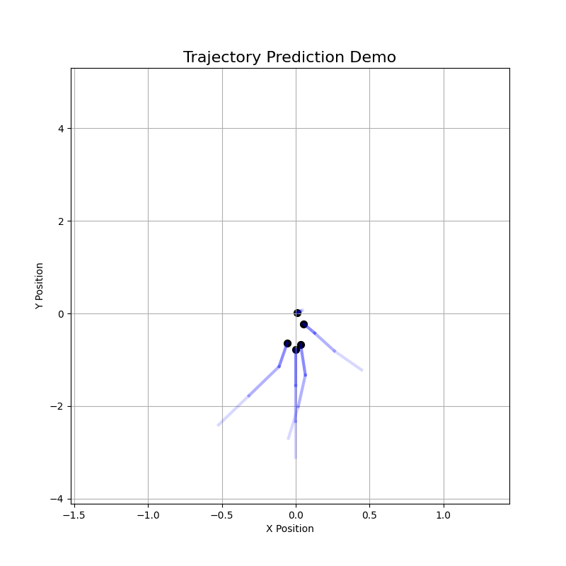
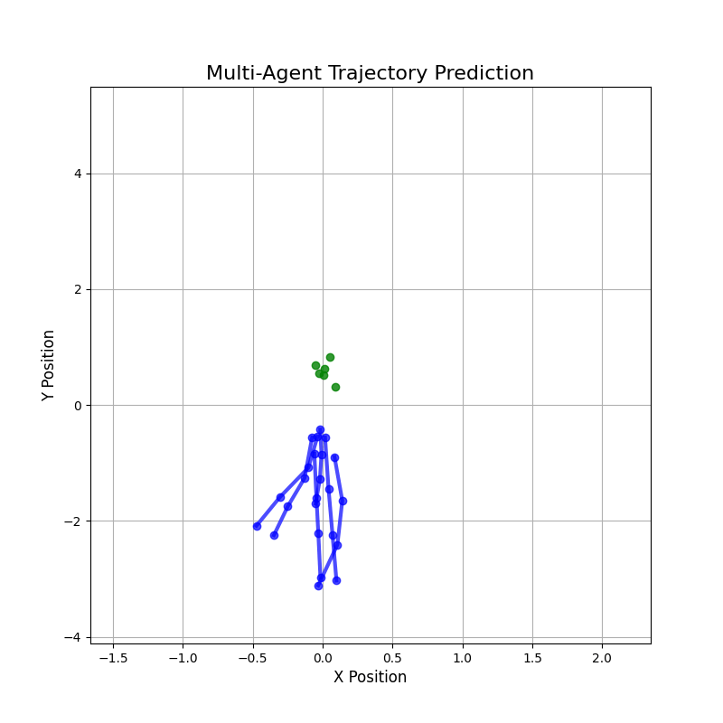
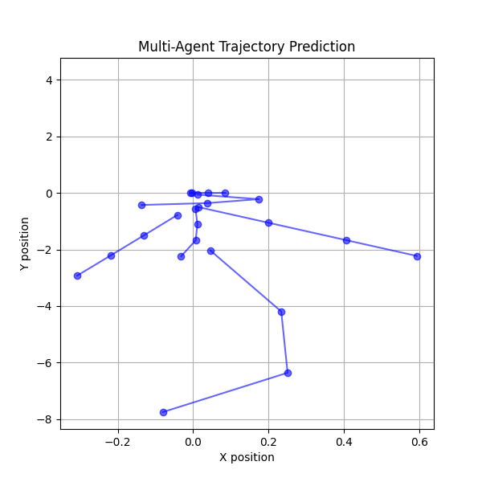

# Transformer-Based Multi-Modal Trajectory Prediction

This project implements a **Transformer-based trajectory prediction model** using the **nuScenes dataset**.

The model predicts the **future positions of pedestrians and cyclists** from past motion.

---

## Model Architecture

Past trajectory (x, y, vx, vy)

↓

Transformer Encoder

↓

Multi-modal trajectory decoder

↓

Predicted future trajectories

---

## Metrics

| Metric | Description |
|------|------|
| ADE | Average Displacement Error |
| FDE | Final Displacement Error |

Example results:

```
ADE ≈ 0.27
FDE ≈ 0.48
```

---

## Visualization

### Research Style Demo
Prediction branches with probability visualization.

<p align="center">

</p>

---

### Video Demo
Full trajectory animation.

[Watch Video](results/trajectory_prediction.mp4)

### Single-Agent Trajectory Prediction
Example prediction with multiple possible futures.

<p align="center">

</p>

---

### Multi-Agent Scene Prediction
Multiple pedestrians moving simultaneously.

<p align="center">

</p>

---
## Installation

```
pip install -r requirements.txt
```

---

## Running

Open the notebook:

```
trajectory_prediction.ipynb
```

---

## Author
Shivapuram Samanvitha
GitHub: https://github.com/samanvithashivapuram
