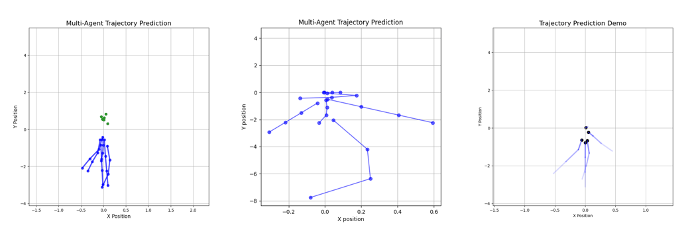

# Transformer-Based Multi-Modal Trajectory Prediction

<p align="center">

</p>

## Problem Statement:

Predicting future trajectories of pedestrians and cyclists is a critical component of autonomous driving systems.

Given the past motion history of an agent, the task is to predict multiple plausible future trajectories.

Challenges include:

• Human motion uncertainty  
• Multi-modal future behaviour  
• Temporal dependencies in motion  

This project implements a **Transformer-based trajectory prediction model** that learns motion patterns from past trajectories and predicts multiple possible futures.

This project implements a **Transformer-based trajectory prediction model** using the **nuScenes dataset**.

The model predicts the **future positions of pedestrians and cyclists** from past motion.

---

## trajectory-prediction-transformer
│
├── models/          trained models
├── results/         visualizations and animations
├── images/          figures used in README
├── trajectory_prediction.ipynb
├── requirements.txt
└── README.md

## Model Architecture

Past Trajectory (2 seconds)  
(x, y, vx, vy)

   ↓

Feature Embedding  
Linear projection → 128 dimensional representation

   ↓

Transformer Encoder  
Multi-Head Self-Attention + Feed-Forward Layers

   ↓

Context Vector  
(final timestep representation)

   ↓

Multi-Modal Decoder

   ↓

Future Trajectory Predictions  
• 3 candidate trajectories  
• probability score for each

---

## Training Details

Model configuration:

Embedding dimension: 128  
Number of trajectory modes: 3  
Prediction horizon: 6 timesteps  

Optimizer: Adam  
Loss function: Multi-modal trajectory loss  

Training objective:

Minimize the distance between predicted trajectories and ground truth trajectories.

## Detailed Model Architecture

Input: Past Agent Trajectory
--------------------------------
Features per timestep:
(x position, y position, x velocity, y velocity)

Sequence Length: 2 seconds of motion


Step 1 — Feature Embedding
--------------------------------
Each timestep feature vector is projected into a higher-dimensional representation.

Input (4D) → Linear Layer → 128D Embedding


Step 2 — Transformer Encoder
--------------------------------
The embedded sequence is processed using a Transformer encoder to model temporal dependencies.

Components:

• Multi-Head Self-Attention
    Each timestep looks at every other timestep to understand the motion pattern. 
    Instead of looking at the motion in one way, the model looks at it in multiple ways simultaneously.
    So the model can understand different motion patterns at the same time.
    
• Feed-Forward Network
    After attention understands the relationships between timesteps, the result goes through a small neural network.
    Linear Layer:
        → ReLU activation
        → Linear Layer
        
• Layer Normalisation
    Neural networks can become unstable while training.
    Layer Normalisation helps by:
        → keeping the values balanced
        → stabilising training
        → improving learning speed


Output:
Temporal motion representation (new representation of the trajectory sequence which includes movement direction, speed changes, trajectory curvature, motion patterns)


Step 3 — Context Extraction
--------------------------------
The encoder output at the final timestep is used as the trajectory context vector.


Step 4 — Multi-Modal Decoder
--------------------------------
A fully connected decoder predicts multiple possible future trajectories.

Outputs:
• 3 candidate trajectories
• Probability score for each trajectory


Step 5 — Future Trajectory Prediction
--------------------------------
Prediction horizon: 3 seconds

Each predicted trajectory contains:
(x, y) coordinates for each timestep

## Metrics

| Metric | Description |
|------|------|
| ADE | Average Displacement Error |
| FDE | Final Displacement Error |

Example results:

```
ADE ≈ 0.27
FDE ≈ 0.48
```

---

## Visualization

### Research Style Demo
Prediction branches with probability visualization.

<p align="center">

</p>

---

### Video Demo
Full trajectory animation.

[Watch Video](results/trajectory_prediction.mp4)

### Single-Agent Trajectory Prediction
Example prediction with multiple possible futures.

<p align="center">

</p>

---

### Multi-Agent Scene Prediction
Multiple pedestrians moving simultaneously.

<p align="center">

</p>

---


## Author
Shivapuram Samanvitha
GitHub: https://github.com/samanvithashivapuram
